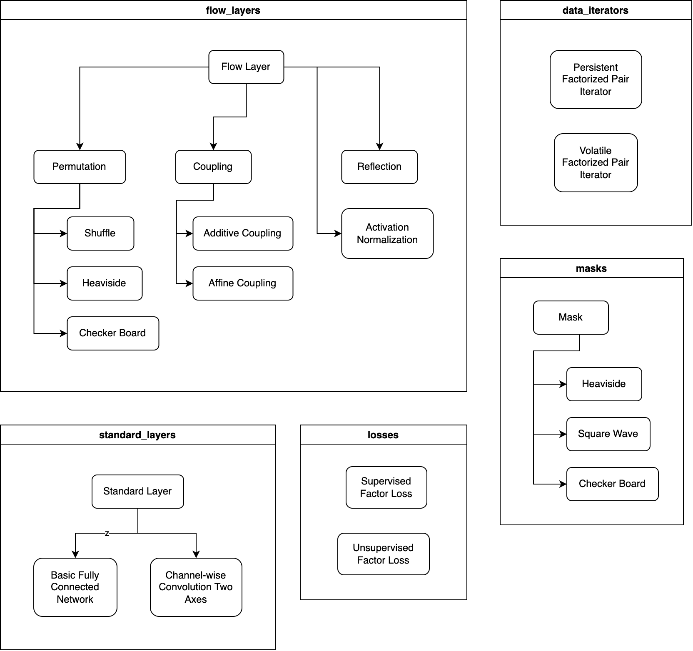

.. gyoza documentation master file, created by
   sphinx-quickstart on Mon Jun  5 21:49:47 2023.
   You can adapt this file completely to your liking, but it should at least
   contain the root `toctree` directive.

Welcome to gyoza's documentation!
=================================

This package can be used to build invertible artificial neural networks, also known as flow transformations.
The below diagram illustrates the structure of modules and their classes. 

For each module a detailed description can be found via the following index:

.. toctree::
   :maxdepth: 4
   :caption: Contents:

   modules

Indices and tables
==================

* :ref:`genindex`
* :ref:`modindex`
* :ref:`search`
